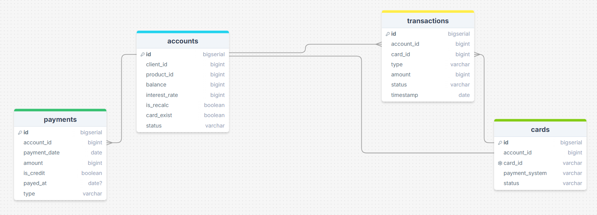
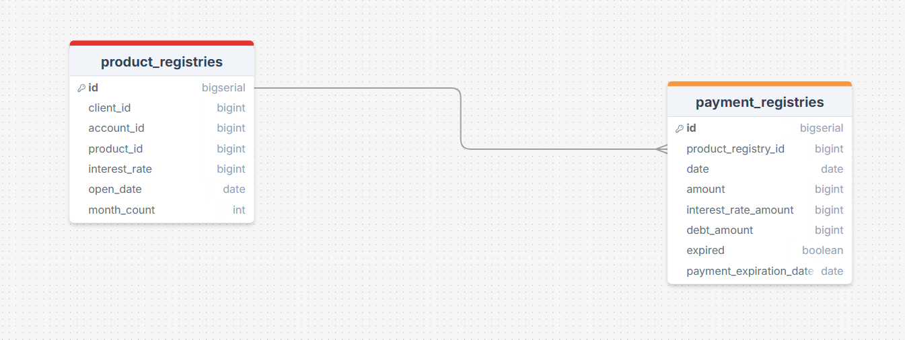
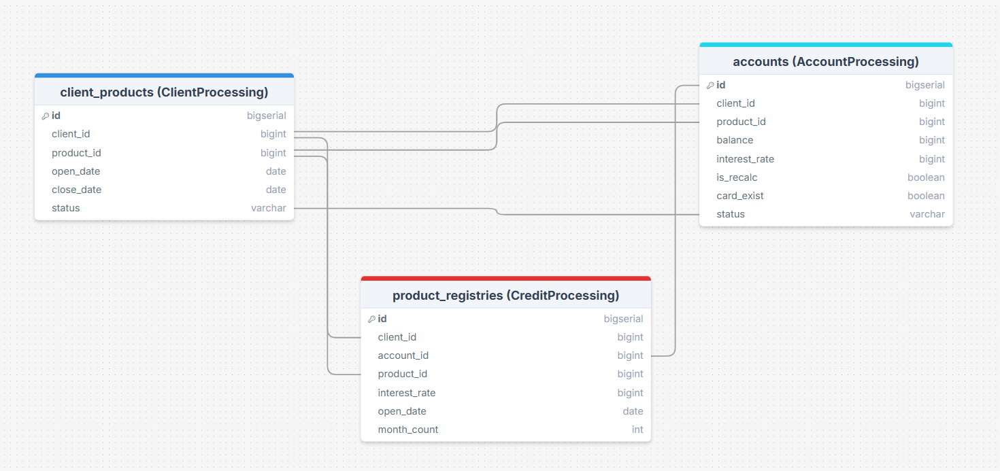

# T1-homework

## Запуск проекта:

```bash
    docker compose build
    docker compose up
```
Будет запущено:

- Три контейнера для сервисов: AccountProcessing, ClientProcessing и CreditProcessing
- Три контейнера для баз данных - для каждого сервиса своя БД + заполнены тестовыми данными
- Два контейнера: t1_kafka + t1_zookeeper

---

## Структура проекта:

В корне проекта находятся:

- Файлы для докера
- Родительский pom.xml
- Три микросервиса:
  - AccountProcessing
  - ClientProcessing
  - CreditProcessing
- core - библиотека с общими типами данных для нескольких сервисов 

---

## Описание каждого сервиса

### ClientProcessing

Главный сервис в данном приложении. Через него проходят все REST запросы от пользователей. Является Kafka Producer - отправляет сообщения остальным сервисам

Функции данного сервиса:

- **Создание клиента (REST)**: создает Client и User в данном сервисе
- **Получение данных клиента (REST)**: необходимо для сервиса CreditProcessing, он запрашивает эти данные для проверки пользователя
- **Работа с продуктами (REST)**: реализованы CRUD запросы
- **Работа с клиентскими продуктами (REST+Kafka)**: получение и создание клиентского продукта в данном сервисе и отправка сообщения для создания на другие сервисы через kafka
- **Перенаправление создания карты (REST+Kafka)**: принимаем и перенаправляем запрос на создание карты в сервис AccountProcessing
- **Перенаправление транзакций (REST+Kafka)**: принимаем и перенаправляем запросы на пополнение/снятие денег в сервис AccountProcessing
- **Перенаправление платежей по кредитным картам (REST+Kafka)**: принимаем и перенаправляем запросы на погашение задолжности в сервис AccountProcessing

Текущая схема базы данных:


---

### AccountProcessing

Сервис для обработки продуктов с ключами: DC, CC, NS, PENS. Работа с переводами, оплатами кредиток, создание карт и акканутов. Все задачи принимает от сервиса ClientProcessing через Kafka

Функции данного сервиса:

- **Создание account (Kafka)**: Принимает запрос через Kafka и создает аккаунт
- **Создание карты (Kafka)**: Принимает запрос через Kafka и создает карту для указанного аккаунта
- **Выполнение транзакций (Kafka)**: Принимает запрос через Kafka и выполняет транзакцию:
  - **Дебетовая карта**: просто выполняет транзакцию (если это возможно)
  - **Кредитная карта**: при снятии денег создает Payment на один месяц с учетом процентной ставки. При пополнении может принудительно перенаправить деньги на погашение задолжности, если есть долги, которые заканчиваются в текущий день
  - **Безопасность**: если по одной карте прошло более 20 операций за час - она блокируется
- **Выполнение платежей по кредитным картам (Kafka)**: Принимает запрос через Kafka и выполняет платеж:
  - **Поступил платеж на сумму равной или больше основного долга**: закрываем все Payment и создаем новый с информацией о пополнении. Пополняем баланс на эту сумму, чтобы потом снова можно было снять деньги
  - **Платеж на сумму менее основного долга**: только создаем Payment с информацией о пополнении. Пополняем баланс на эту сумму, чтобы потом снова можно было снять деньги

Текущая схема базы данных:



---

### CreditProcessing

Сервис для обработки продуктов с ключами: IPO, PC, AC. Работа с открытием кредита и расчетом платежей, перед этим проверяет пользователя и возможность открытия кредита для него. Все задачи принимает от сервиса ClientProcessing через Kafka

Функции данного сервиса:

- **Открытие кредита (Kafka+REST)**: Делает проверку пользователя - запрашивает его данные (через REST у сервиса ClientProcessing), история платежей и сумма всех его кредитов. Если все хорошо, то создает кредит
- **Расчет платежей**: На основании запрашиваемого кредита, процентной ставки (установлена в конфиге) и срока закрытия кредита расчитывает график всех платежей и записывает их

Текущая схема базы данных:



---

### Взаимодействие сервисов

Для более удобного взаимодействия была создана библиотека `core`, от которой зависят все сервисы. В этой библиотеке хранятся общие типы данных, такие как `Event` для Kafka и некоторые `Enum`

Текущие связи и взаимодействие баз данных между сервисами (напрямую не связаны, но имеют общие поля и данные):



[Ссылка на диаграмы баз данных](https://drawsql.app/teams/dima-40/diagrams/t1)
